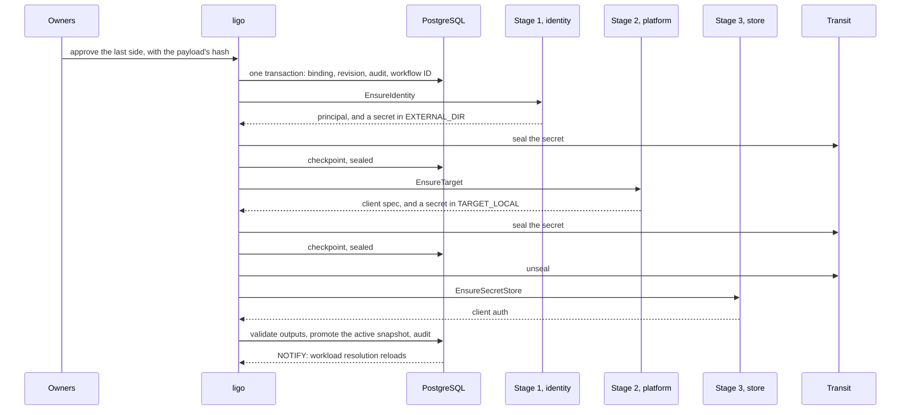

Applying a binding.

```mermaid
sequenceDiagram
  participant O as Owners
  participant L as ligo
  participant D as PostgreSQL
  participant I as Stage 1, identity
  participant P as Stage 2, platform
  participant S as Stage 3, store
  participant V as Transit
  O->>L: approve the last side, with the payload's hash
  L->>D: one transaction: binding, revision, audit, workflow ID
  L->>I: EnsureIdentity
  I-->>L: principal, and a secret in EXTERNAL_DIR
  L->>V: seal the secret
  L->>D: checkpoint, sealed
  L->>P: EnsureTarget
  P-->>L: client spec, and a secret in TARGET_LOCAL
  L->>V: seal the secret
  L->>D: checkpoint, sealed
  L->>V: unseal
  L->>S: EnsureSecretStore
  S-->>L: client auth
  L->>D: validate outputs, promote the active snapshot, audit
  D-->>L: NOTIFY: workload resolution reloads
```
