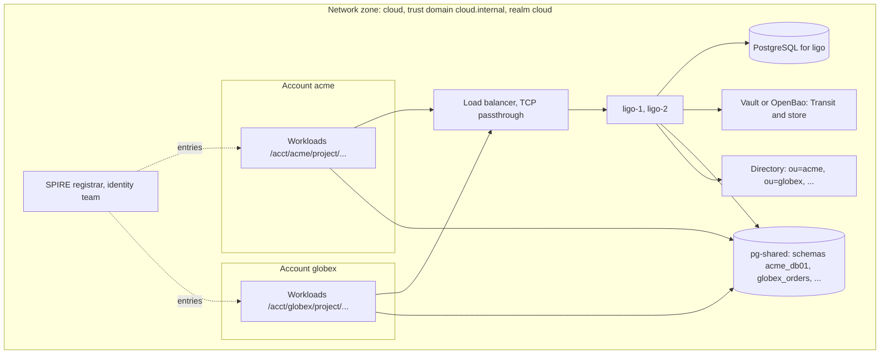

Blueprint 11, a multitenant cloud (Planning for Deployment Guide).

```mermaid
flowchart TB
  subgraph Z["Network zone: cloud, trust domain cloud.internal, realm cloud"]
    subgraph A1["Account acme"]
      W1["Workloads /acct/acme/project/..."]
    end
    subgraph A2["Account globex"]
      W2["Workloads /acct/globex/project/..."]
    end
    R["SPIRE registrar, identity team"]
    LB["Load balancer, TCP passthrough"]
    L["ligo-1, ligo-2"]
    PG[("PostgreSQL for ligo")]
    V["Vault or OpenBao: Transit and store"]
    T[("pg-shared: schemas acme_db01, globex_orders, ...")]
    D["Directory: ou=acme, ou=globex, ..."]
  end
  R -.->|"entries"| W1
  R -.->|"entries"| W2
  W1 --> LB
  W2 --> LB
  LB --> L
  L --> PG
  L --> V
  L --> T
  L --> D
  W1 --> T
  W2 --> T
```
