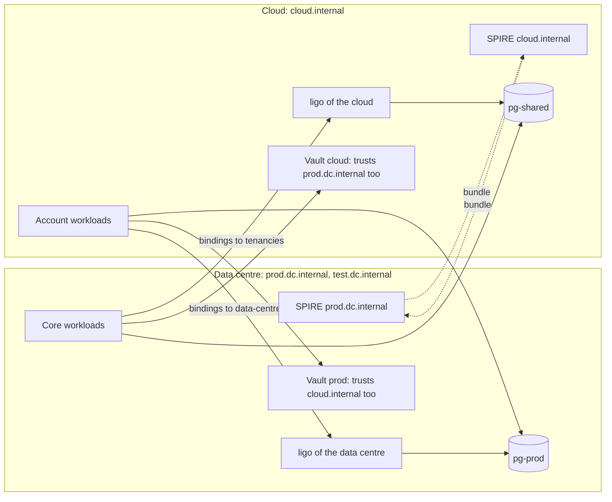

Blueprint 13, a data centre interconnected with a multitenant cloud (Planning for Deployment Guide).

```mermaid
flowchart LR
  subgraph DC["Data centre: prod.dc.internal, test.dc.internal"]
    direction TB
    DW["Core workloads"]
    DS["SPIRE prod.dc.internal"]
    DL["ligo of the data centre"]
    DV["Vault prod: trusts cloud.internal too"]
    DP[("pg-prod")]
  end
  subgraph CL["Cloud: cloud.internal"]
    direction TB
    CW["Account workloads"]
    CS["SPIRE cloud.internal"]
    CLG["ligo of the cloud"]
    CV["Vault cloud: trusts prod.dc.internal too"]
    CP[("pg-shared")]
  end
  CS -.->|"bundle"| DS
  DS -.->|"bundle"| CS
  CW -->|"bindings to data-centre data"| DL
  DW -->|"bindings to tenancies"| CLG
  DL --> DP
  CLG --> CP
  CW --> DV
  CW --> DP
  DW --> CV
  DW --> CP
```
