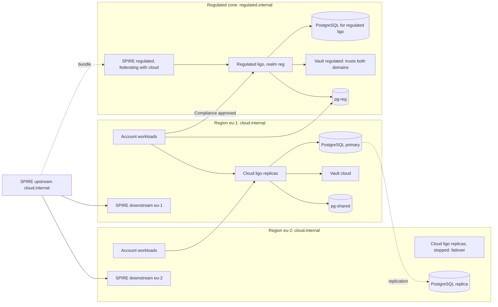

Blueprint 12, a multitenant cloud over several network zones (Planning for Deployment Guide).

```mermaid
flowchart LR
  subgraph E1["Region eu-1: cloud.internal"]
    direction TB
    W1["Account workloads"]
    D1["SPIRE downstream eu-1"]
    L1["Cloud ligo replicas"]
    P1[("PostgreSQL primary")]
    V1["Vault cloud"]
    T1[("pg-shared")]
  end
  subgraph E2["Region eu-2: cloud.internal"]
    direction TB
    W2["Account workloads"]
    D2["SPIRE downstream eu-2"]
    L2["Cloud ligo replicas, stopped: failover"]
    P2[("PostgreSQL replica")]
  end
  U["SPIRE upstream cloud.internal"]
  subgraph RZ["Regulated zone: regulated.internal"]
    direction TB
    RS["SPIRE regulated, federating with cloud"]
    RL["Regulated ligo, realm reg"]
    RP[("PostgreSQL for regulated ligo")]
    RV["Vault regulated: trusts both domains"]
    RT[("pg-reg")]
  end
  U --> D1
  U --> D2
  W1 --> L1
  W2 --> L1
  L1 --> P1
  P1 -.->|"replication"| P2
  L1 --> V1
  L1 --> T1
  U -.->|"bundle"| RS
  RS --> RL
  W1 -->|"Compliance approved"| RL
  RL --> RP
  RL --> RV
  RL --> RT
  W1 --> RT
```
