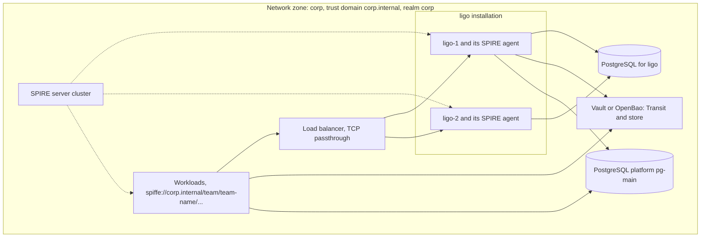

Blueprint 9, a single network zone (Planning for Deployment Guide).

```mermaid
flowchart TB
  subgraph Z["Network zone: corp, trust domain corp.internal, realm corp"]
    W["Workloads, spiffe://corp.internal/team/team-name/..."]
    LB["Load balancer, TCP passthrough"]
    subgraph L["ligo installation"]
      L1["ligo-1 and its SPIRE agent"]
      L2["ligo-2 and its SPIRE agent"]
    end
    S["SPIRE server cluster"]
    PG[("PostgreSQL for ligo")]
    V["Vault or OpenBao: Transit and store"]
    T[("PostgreSQL platform pg-main")]
  end
  W --> LB --> L1
  LB --> L2
  S -.-> L1
  S -.-> L2
  S -.-> W
  L1 --> PG
  L2 --> PG
  L1 --> V
  L1 --> T
  W --> V
  W --> T
```
