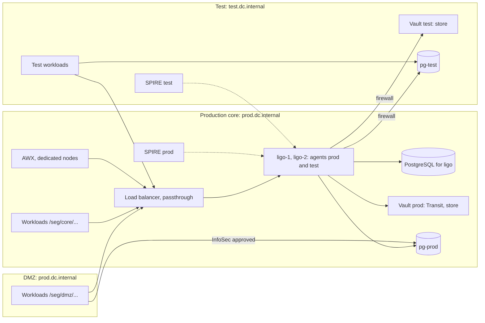

Blueprint 10, a traditional data centre (Planning for Deployment Guide).

```mermaid
flowchart LR
  subgraph DMZ["DMZ: prod.dc.internal"]
    direction TB
    WD["Workloads /seg/dmz/..."]
  end
  subgraph CORE["Production core: prod.dc.internal"]
    direction TB
    WC["Workloads /seg/core/..."]
    AWX["AWX, dedicated nodes"]
    LB["Load balancer, passthrough"]
    L["ligo-1, ligo-2: agents prod and test"]
    PG[("PostgreSQL for ligo")]
    VP["Vault prod: Transit, store"]
    PP[("pg-prod")]
    SP["SPIRE prod"]
  end
  subgraph TEST["Test: test.dc.internal"]
    direction TB
    WT["Test workloads"]
    VT["Vault test: store"]
    PT[("pg-test")]
    ST["SPIRE test"]
  end
  WD --> LB
  WC --> LB
  AWX --> LB
  WT --> LB
  LB --> L
  L --> PG
  L --> VP
  L --> PP
  L -->|"firewall"| PT
  L -->|"firewall"| VT
  SP -.-> L
  ST -.-> L
  WD -->|"InfoSec approved"| PP
  WT --> PT
```
