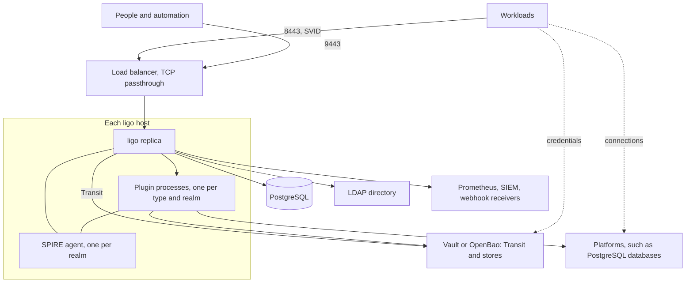

The parts of an installation, and who talks to whom (Planning for Deployment Guide, chapter 2).

```mermaid
flowchart TB
  W["Workloads"]
  A["People and automation"]
  LB["Load balancer, TCP passthrough"]
  subgraph H["Each ligo host"]
    R["ligo replica"]
    SA["SPIRE agent, one per realm"]
    P["Plugin processes, one per type and realm"]
  end
  PG[("PostgreSQL")]
  V["Vault or OpenBao: Transit and stores"]
  D["LDAP directory"]
  T["Platforms, such as PostgreSQL databases"]
  O["Prometheus, SIEM, webhook receivers"]
  W -->|"8443, SVID"| LB
  A -->|"9443"| LB
  LB --> R
  R --- SA
  R --> P
  P --- SA
  R --> PG
  R -->|"Transit"| V
  R --> D
  P --> T
  P --> V
  W -.->|"credentials"| V
  W -.->|"connections"| T
  R --> O
```
