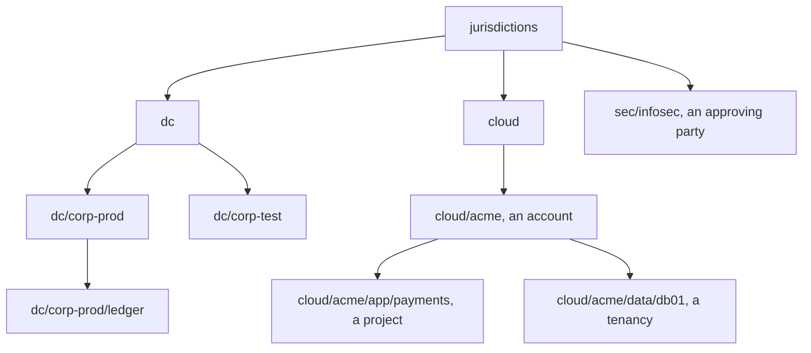

An example jurisdiction tree (Planning for Deployment Guide, chapter 6).

```mermaid
flowchart TB
  R["jurisdictions"]
  DC["dc"]
  P["dc/corp-prod"]
  L["dc/corp-prod/ledger"]
  T["dc/corp-test"]
  C["cloud"]
  A["cloud/acme, an account"]
  AP["cloud/acme/app/payments, a project"]
  AD["cloud/acme/data/db01, a tenancy"]
  S["sec/infosec, an approving party"]
  R --> DC
  R --> C
  R --> S
  DC --> P
  P --> L
  DC --> T
  C --> A
  A --> AP
  A --> AD
```
