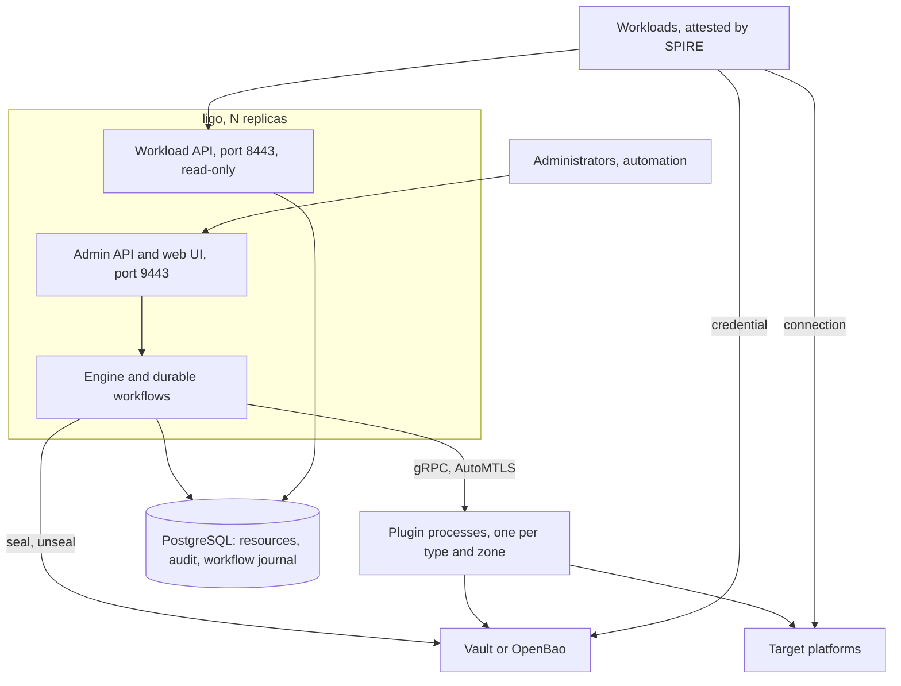

The components of ligo.

```mermaid
flowchart TB
  W["Workloads, attested by SPIRE"]
  A["Administrators, automation"]
  subgraph L["ligo, N replicas"]
    WA["Workload API, port 8443, read-only"]
    AA["Admin API and web UI, port 9443"]
    E["Engine and durable workflows"]
    WA ~~~ AA
    AA --> E
  end
  P["Plugin processes, one per type and zone"]
  DB[("PostgreSQL: resources, audit, workflow journal")]
  V["Vault or OpenBao"]
  T["Target platforms"]
  W --> WA
  A --> AA
  E --> DB
  WA --> DB
  E -->|"seal, unseal"| V
  E -->|"gRPC, AutoMTLS"| P
  P --> T
  P --> V
  W -->|"credential"| V
  W -->|"connection"| T
```
