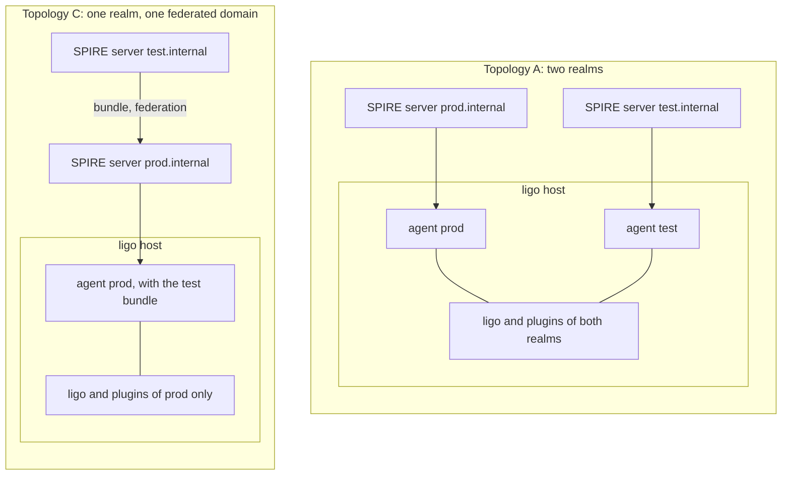

Topologies A and C (Planning for Deployment Guide, chapter 3).

```mermaid
flowchart TB
  subgraph A["Topology A: two realms"]
    direction TB
    SP1["SPIRE server prod.internal"]
    ST1["SPIRE server test.internal"]
    subgraph HA["ligo host"]
      AP1["agent prod"]
      AT1["agent test"]
      L1["ligo and plugins of both realms"]
    end
    SP1 --> AP1
    ST1 --> AT1
    AP1 --- L1
    AT1 --- L1
  end
  subgraph C["Topology C: one realm, one federated domain"]
    direction TB
    SP2["SPIRE server prod.internal"]
    ST2["SPIRE server test.internal"]
    subgraph HC["ligo host"]
      AP2["agent prod, with the test bundle"]
      L2["ligo and plugins of prod only"]
    end
    ST2 -->|"bundle, federation"| SP2
    SP2 --> AP2
    AP2 --- L2
  end
```
