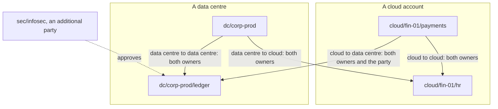

The four topologies, and who consents.

```mermaid
flowchart TB
  subgraph C["A cloud account"]
    P["cloud/fin-01/payments"]
    H["cloud/fin-01/hr"]
  end
  subgraph D["A data centre"]
    X["dc/corp-prod"]
    Y["dc/corp-prod/ledger"]
  end
  S["sec/infosec, an additional party"]
  P -->|"cloud to cloud: both owners"| H
  X -->|"data centre to data centre: both owners"| Y
  P -->|"cloud to data centre: both owners and the party"| Y
  X -->|"data centre to cloud: both owners"| H
  S -.->|"approves"| Y
```
