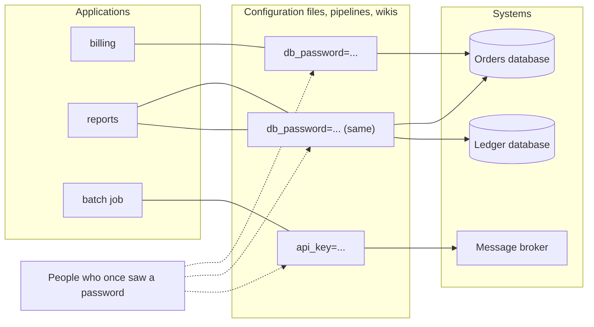

Today: passwords copied into each application (Why ligo?, chapter 1).

```mermaid
flowchart LR
  subgraph APPS["Applications"]
    A1["billing"]
    A2["reports"]
    A3["batch job"]
  end
  subgraph CFG["Configuration files, pipelines, wikis"]
    P1["db_password=..."]
    P2["db_password=... (same)"]
    P3["api_key=..."]
  end
  subgraph SYS["Systems"]
    D1[("Orders database")]
    D2[("Ledger database")]
    K["Message broker"]
  end
  A1 --- P1 --> D1
  A2 --- P2 --> D1
  A2 --- P2 --> D2
  A3 --- P3 --> K
  H["People who once saw a password"] -.-> P1
  H -.-> P2
  H -.-> P3
```
