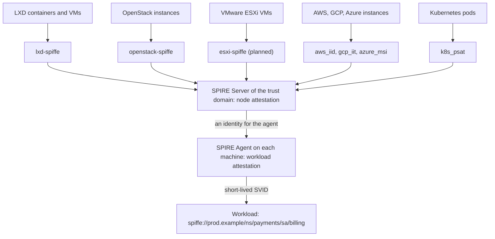

Step one: every machine and workload gets an identity (Why ligo?, section 3).

```mermaid
flowchart TB
  LXD["LXD containers and VMs"] --> L1["lxd-spiffe"]
  OS["OpenStack instances"] --> O1["openstack-spiffe"]
  ESX["VMware ESXi VMs"] --> E1["esxi-spiffe (planned)"]
  CL["AWS, GCP, Azure instances"] --> C1["aws_iid, gcp_iit, azure_msi"]
  K8S["Kubernetes pods"] --> K1["k8s_psat"]
  L1 --> S["SPIRE Server of the trust domain: node attestation"]
  O1 --> S
  E1 --> S
  C1 --> S
  K1 --> S
  S -->|"an identity for the agent"| AG["SPIRE Agent on each machine: workload attestation"]
  AG -->|"short-lived SVID"| W["Workload: spiffe://prod.example/ns/payments/sa/billing"]
```
