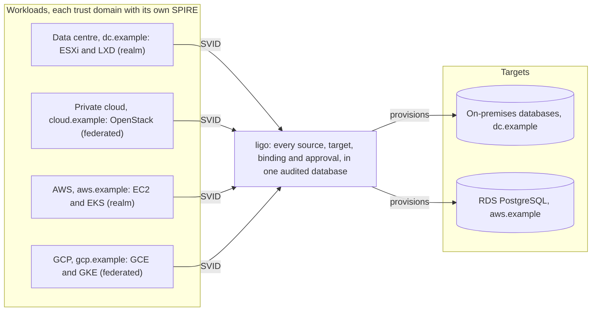

Across realms: one view of who may use what, wherever it runs (Why ligo?, section 4).

```mermaid
flowchart LR
  subgraph TD["Workloads, each trust domain with its own SPIRE"]
    DCW["Data centre, dc.example: ESXi and LXD (realm)"]
    PCW["Private cloud, cloud.example: OpenStack (federated)"]
    AWSW["AWS, aws.example: EC2 and EKS (realm)"]
    GCPW["GCP, gcp.example: GCE and GKE (federated)"]
  end
  LG["ligo: every source, target, binding and approval, in one audited database"]
  subgraph T["Targets"]
    DCT[("On-premises databases, dc.example")]
    AWST[("RDS PostgreSQL, aws.example")]
  end
  DCW -->|"SVID"| LG
  PCW -->|"SVID"| LG
  AWSW -->|"SVID"| LG
  GCPW -->|"SVID"| LG
  LG -->|"provisions"| DCT
  LG -->|"provisions"| AWST
```
