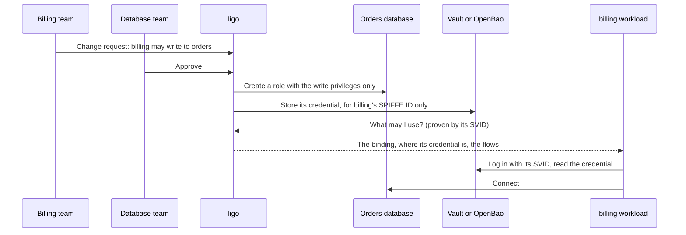

Step two: ligo wires an identity to a resource (Why ligo?, section 4).

```mermaid
sequenceDiagram
  participant BT as Billing team
  participant DT as Database team
  participant L as ligo
  participant DB as Orders database
  participant V as Vault or OpenBao
  participant W as billing workload
  BT->>L: Change request: billing may write to orders
  DT->>L: Approve
  L->>DB: Create a role with the write privileges only
  L->>V: Store its credential, for billing's SPIFFE ID only
  W->>L: What may I use? (proven by its SVID)
  L-->>W: The binding, where its credential is, the flows
  W->>V: Log in with its SVID, read the credential
  W->>DB: Connect
```
